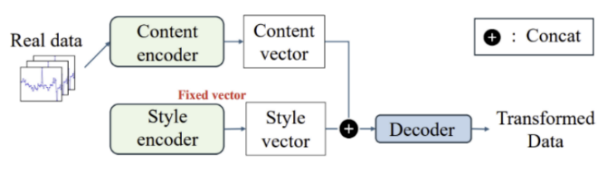
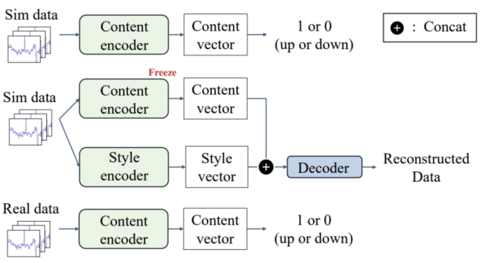

# VAE 기반 Real-to-Sim 전이를 통한 실제 데이터 수집 한계를 보완

> 한국통신학회 논문 / 소프트콘 발표 (2025.02 ~ 2025.06)

## Overview

시뮬레이션과 실제 환경 간의 도메인 갭(domain gap)으로 인해, 시뮬레이션에서 학습된 모델이 실제 환경에서 성능 저하를 보이는 **Sim2Real 문제**를 해결하기 위한 연구입니다.

기존의 CycleGAN 등 생성 모델 방식의 한계(의미 정보 손상, temporal 정보 유실, 센서 노이즈 반영 어려움)를 극복하기 위해, **Multi-Encoder VAE 기반 Real-to-Sim 전이** 방법을 제안합니다.

실제 데이터의 주요 특성은 유지하되, 가상 데이터와의 간극을 좁히는 것이 목표입니다.

**제안 방법** — Real2Sim 표현 공간으로 정렬:

- **Sequence encoder (GRU)**: 시계열 구조 반영
- **Disentanglement (요소 분리)**
  - content: 동작 (phase)
  - style: 도메인 (real vs sim)
- **Mutual information loss**: content / style 분리

## Data

### 실제 데이터 수집

- **기기**: iPhone 13 mini + Apple Watch Series 7
- **UWB 거리 측정**: iOS Nearby Interaction API (약 5Hz)
- **IMU 센서**: Core Motion API — 가속도 + 각속도 (약 20Hz)
- **전처리**: 서로 다른 주기(5Hz vs 20Hz)를 맞추기 위해 UWB 데이터를 선형 보간(linear interpolation)으로 20Hz로 업샘플링
- **데이터셋**: 총 100회 스쿼트 동작 수집

### 가상 데이터 생성

- **시뮬레이터**: MuJoCo Humanoid 모델
- **제어기**: PD 제어기 (Proportional-Derivative Controller)
  - $e = x_{target} - x$
  - $u = K_p \cdot e + K_d \cdot \dot{e}$
- **Domain Randomization**: 수집마다 가상 휴대폰과 워치의 위치를 무작위로 설정

## Model Architecture

Content와 Style을 분리 학습하는 **Multi-Encoder VAE** 구조를 사용합니다.  
기존의 여러 인코더를 동시에 학습시키는 방식과 달리, 각 인코더를 **개별적으로 학습**시켜 서로 배타적인 정보를 학습하도록 유도합니다.



### A. Content Encoder

- 실제 동작 단계(0: 앉는 자세, 1: 정 자세)의 특징을 표현
- 현재 프레임 기준 이전 10 프레임 + 이후 5 프레임의 시계열 데이터 활용
- **Bi-GRU** 모델을 통해 앞뒤 temporal 정보를 반영

### B. Style Encoder

- 가상 데이터 도메인의 특징을 표현하는 고정된 잠재 벡터 추출
- 가상 데이터만 활용하여 도메인 분포를 학습
- 잠재 벡터 샘플링: $z_s = \mu + \epsilon \cdot \sigma, \quad \epsilon \sim \mathcal{N}(0, I)$

### C. Decoder

- Content 벡터와 Style 벡터를 결합하여 실제 데이터를 가상 데이터 도메인으로 변환
- 학습 가능한 가중치 계수 $\alpha$로 두 정보의 비중을 자동 조절

$$z = \alpha \cdot z_c + (1 - \alpha) \cdot z_s$$

## Training



### Step 1. Content Encoder 학습 (가상 데이터, 지도 학습)

가상 데이터의 동작 단계(0/1) 레이블을 이용해 Content Encoder를 지도 학습으로 학습합니다.

### Step 2. Style Encoder + Decoder 학습 (가상 데이터)

Content Encoder를 **Frozen**한 상태로, Style Encoder와 Decoder를 가상 데이터만으로 학습합니다.

**손실 함수:**

$$\mathcal{L}_{StyleEncoder} = \mathcal{L}_{recon} + \mathcal{L}_{KLD} + \lambda \cdot \mathcal{L}_{MINE}$$

**Reconstruction Loss** — 시뮬레이션 데이터 복원 품질

$$\mathcal{L}_{recon} = \|x^{sim} - \hat{x}^{sim}\|^2$$

**KL Divergence Loss** — Latent 분포를 정규분포로 정규화

$$\mathcal{L}_{KLD} = D_{KL}(q(z_s \mid x) \Vert \mathcal{N}(0, I))$$

**MINE Loss** — Content와 Style 간의 상호 정보량 최소화

$$\mathcal{L}_{MINE} = -\left(\mathbb{E}_{p(z_c,z_s)}[f(z_c,z_s)] - \log\mathbb{E}_{p(z_c)p(z_s)}\left[e^{f(z_c,z_s)}\right]\right)$$

### Step 3. Content Encoder 파인 튜닝 (실제 데이터)

수집량이 적은 실제 데이터로 Content Encoder를 파인 튜닝하여, 실제 환경에서도 동작 단계 특징을 인식할 수 있도록 합니다.

## Results

가상 데이터만으로 학습된 스쿼트 동작 단계 인식 모델의 변환 데이터셋 기반 테스트 성능 비교:

| Train | Test | Accuracy |
|-------|------|----------|
| 가상 데이터 | 실제 데이터 | 55.80% |
| 가상 데이터 | 변환 데이터 (VAE) | 59.77% |
| 가상 데이터 | 변환 데이터 (Proposed) | **74.90%** |

제안 모델로 변환된 데이터를 사용할 경우 기존 VAE 대비 약 **15%p** 성능 향상을 달성했습니다.

## Conclusion

- 두 인코더의 **분리 학습** + **MINE loss**를 통해 Content와 Style 정보의 독립성 강화
- **학습 가능한 가중치 계수** $\alpha$를 통해 두 정보 간 균형을 동적으로 조절
- 실제 데이터 수집의 한계를 보완하여 Sim2Real 도메인 갭을 효과적으로 축소

## Repository Structure

```
real2sim_exercise/
├── data/                    # 데이터 전처리 노트북 및 CSV
├── simulate_data/           # MuJoCo 시뮬레이션 스크립트 및 데이터
├── real_data/               # 실제 수집 데이터
├── model/                   # Content Encoder 학습 노트북 (GRU, LSTM, Bi-GRU 등)
├── real2sim/                # VAE 기반 Real2Sim 모델 노트북
│   ├── style_content_vae.ipynb      # 제안 모델 (Sim 학습)
│   ├── style_content_vae_real.ipynb # 제안 모델 (Real 적용)
│   ├── lstm_VAE.ipynb               # LSTM VAE 비교 모델
│   └── propose_vs_vae.ipynb         # 성능 비교
└── figure/                  # 아키텍처 다이어그램
```
